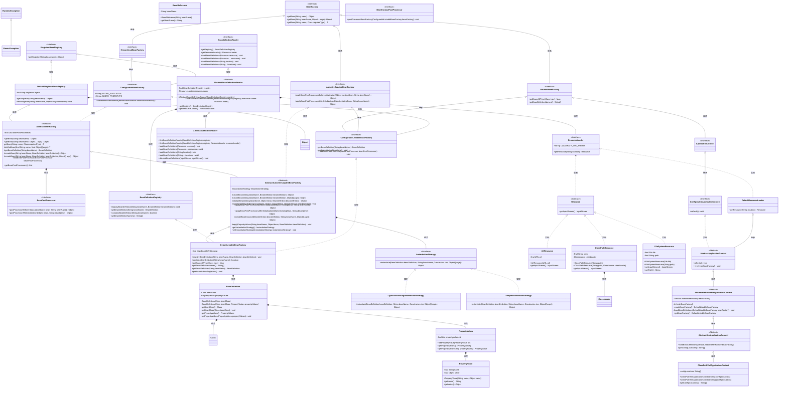

# Spring 架构类图

```mermaid
classDiagram

class RuntimeException

class BeansException

RuntimeException <|-- BeansException

class BeanDefinition{
-Class beanClass
-PropertyValues propertyValues
+BeanDefinition(Class beanClass)
+BeanDefinition(Class beanClass, PropertyValues propertyValues)
+getBeanClass() Class
+setBeanClass(Class beanClass) void
+getPropertyValues() PropertyValues
+setPropertyValues(PropertyValues propertyValues) void
}
BeanDefinition*--Class : 组合
BeanDefinition*--PropertyValues : 组合

class BeanReference{
-String beanName
+BeanReference(String beanName)
+getBeanName() String
}

class BeanFactory{
<<Interface>>
+getBean(String name) Object
+getBean(String beanName, Object... args) Object
+getBean(String name, Class<T> requiredType) T
}

class BeanFactoryPostProcessor{
<<Interface>>
+postProcessorBeanFactory(ConfigurableListableBeanFactory beanFactory) void
}

class InstantiationStrategy{
<<Interface>>
+instantiate(BeanDefinition beanDefinition, String beanName, Constructor ctor, Object[] args) Object
}

class PropertyValue{
-final String name
-final Object value
+PropertyValue(String name, Object value)
+getName() String
+getValue() Object
}

class PropertyValues{
-final List<PropertyValue> propertyValueList
+addPropertyValue(PropertyValue pv)
+getPropertyValues() PropertyValue[]
+getPropertyValue(String propertyName) PropertyValue
}
PropertyValues*--PropertyValue : 组合

class ListableBeanFactory{
<<Interface>>
+getBeansOfType(Class<T> type) Map<String, T>
+getBeanDefinitionNames() String[]
}
BeanFactory<|-- ListableBeanFactory : 继承


class ConfigurableListableBeanFactory{
<<Interface>>
+getBeanDefinition(String beanName) BeanDefinition
+preInstantiationSingletons() void
+addBeanPostProcessor(BeanPostProcessor beanPostProcessor) void
}
ListableBeanFactory<|--ConfigurableListableBeanFactory : 继承
AutowireCapableBeanFactory<|--ConfigurableListableBeanFactory : 继承
ConfigurableBeanFactory<|--ConfigurableListableBeanFactory : 继承

class AutowireCapableBeanFactory{
<<Interface>>
+applyBeanPostProcessorsBeforeInitialization(Object existingBean, String beanName) Object
+applyBeanPostProcessorsAfterInitialization(Object existingBean, String beanName) Object
}
BeanFactory<|-- AutowireCapableBeanFactory : 继承

class SingletonBeanRegistry{
<<Interface>>
+getSingleton(String beanName) Object
}

class BeanPostProcessor{
<<Interface>>
+postProcessorBeforeInitialization(Object bean, String beanName) Object
+postProcessorAfterInitialization(Object bean, String beanName) Object
}

class BeanDefinitionReader{
<<Interface>>
+getRegistry() BeanDefinitionRegistry
+getResourceLoader() ResourceLoader
+loadBeanDefinitions(Resource resource) void
+loadBeanDefinitions(Resource... resources) void
+loadBeanDefinitions(String location) void
+loadBeanDefinitions(String... locations) void
}

class AbstractBeanDefinitionReader{
<<Abstract>>
-final BeanDefinitionRegistry registry
-ResourceLoader resourceLoader
#AbstractBeanDefinitionReader(BeanDefinitionRegistry registry)
+AbstractBeanDefinitionReader(BeanDefinitionRegistry registry, ResourceLoader resourceLoader)
+getRegistry() BeanDefinitionRegistry
+getResourceLoader() ResourceLoader
}
BeanDefinitionReader<|..AbstractBeanDefinitionReader : 实现
AbstractBeanDefinitionReader*--BeanDefinitionRegistry : 组合
AbstractBeanDefinitionReader*--ResourceLoader : 组合	

class XmlBeanDefinitionReader{
+XmlBeanDefinitionReader(BeanDefinitionRegistry registry)
+XmlBeanDefinitionReader(BeanDefinitionRegistry registry, ResourceLoader resourceLoader)
+loadBeanDefinitions(Resource resource) void
+loadBeanDefinitions(Resource... resources) void
+loadBeanDefinitions(String location) void
+loadBeanDefinitions(String... locations) void
+doLoadBeanDefinitions(InputStream inputStream) void
}
AbstractBeanDefinitionReader<|--XmlBeanDefinitionReader : 继承

class BeanDefinitionRegistry{
<<Interface>>
+registryBeanDefinition(String beanName, BeanDefinition beanDefinition) void
+getBeanDefinition(String beanName) BeanDefinition
+containsBeanDefinition(String beanName) boolean
+getBeanDefinitionNames() String[]
}

class HierarchicalBeanFactory{
<<Interface>>
}
BeanFactory<|-- HierarchicalBeanFactory : 继承

class ConfigurableBeanFactory{
<<Interface>>
+String SCOPE_SINGLETON
+String SCOPE_PROTOTYPE

+addBeanPostProcessor(BeanPostProcessor beanPostProcessor) void
}
HierarchicalBeanFactory<|-- ConfigurableBeanFactory : 继承
SingletonBeanRegistry<|-- ConfigurableBeanFactory : 继承


class AbstractAutowireCapableBeanFactory{
<<Abstract>>
-InstantiationStrategy instantiationStrategy
#createBean(String beanName, BeanDefinition beanDefinition) Object
#createBean(String beanName, BeanDefinition beanDefinition, Object[] args) Object
-initializeBean(String beanName, Object bean, BeanDefinition beanDefinition) Object
-invokeInitMethods(String beanName, Object wrapperBean, BeanDefinition beanDefinition) void
+applyBeanPostProcessorsBeforeInitialization(Object existingBean, String beanName) Object
+applyBeanPostProcessorsAfterInitialization(Object existingBean, String beanName) Object
#createBeanInstance(BeanDefinition beanDefinition, String beanName, Object[] args) Object
#applyPropertyValues(String beanName, Object bean, BeanDefinition beanDefinition) void
+getInstantiationStrategy() InstantiationStrategy
+setInstantiationStrategy(InstantiationStrategy instantiationStrategy) void
}
AbstractBeanFactory<|-- AbstractAutowireCapableBeanFactory : 继承
AutowireCapableBeanFactory<|.. AbstractAutowireCapableBeanFactory : 实现
AbstractAutowireCapableBeanFactory*--InstantiationStrategy : 组合

class DefaultSingletonBeanRegistry{
-final Map<String, Object> singletonObjects

+getSingleton(String beanName) Object
#addSingleton(String beanName, Object singletonObject) void
}
SingletonBeanRegistry<|.. DefaultSingletonBeanRegistry : 实现
DefaultSingletonBeanRegistry*--Object : 组合

class AbstractBeanFactory{
<<Abstract>>
-final List<BeanPostProcessor> beanPostProcessors

+getBean(String beanName) Object
+getBean(String beanName, Object... args) Object
getBean(String name, Class<T> requiredType) T
#doGetBean(final String name, final Object[] args) T
#getBeanDefinition(String beanName) BeanDefinition
#createBean(String beanName, BeanDefinition beanDefinition) Object
#createBean(String beanName, BeanDefinition beanDefinition, Object[] args) Object
+addBeanPostProcessor(BeanPostProcessor beanPostProcessor)
+getBeanPostProcessors() List<BeanPostProcessor>
}
DefaultSingletonBeanRegistry<|-- AbstractBeanFactory : 继承
ConfigurableBeanFactory<|.. AbstractBeanFactory : 实现
AbstractBeanFactory*--BeanPostProcessor : 组合


class DefaultListableBeanFactory{
-final Map<String, BeanDefinition> beanDefinitionMap
+registryBeanDefinition(String beanName, BeanDefinition beanDefinition) void
+containsBeanDefinition(String beanName) boolean
+getBeansOfType(Class<T> type) Map<String, T>
+getBeanDefinitionNames() String[]
+getBeanDefinition(String beanName) BeanDefinition
+preInstantiationSingletons() void
}
AbstractAutowireCapableBeanFactory<|-- DefaultListableBeanFactory : 继承
BeanDefinitionRegistry<|.. DefaultListableBeanFactory : 实现
ConfigurableListableBeanFactory<|.. DefaultListableBeanFactory : 实现
DefaultListableBeanFactory*--BeanDefinition : 组合

class CglibSubclassingInstantiationStrategy{
+instantiate(BeanDefinition beanDefinition, String beanName, Constructor ctor, Object[] args) Object
}
InstantiationStrategy<|..CglibSubclassingInstantiationStrategy : 实现

class SimpleInstantiationStrategy{
+instantiate(BeanDefinition beanDefinition, String beanName, Constructor ctor, Object[] args) Object
}
InstantiationStrategy<|..SimpleInstantiationStrategy : 实现

class ApplicationContext{
<<Interface>>
}
ListableBeanFactory<|--ApplicationContext : 继承

class ConfigurableApplicationContext{
<<Interface>>
+refresh() void
}
ApplicationContext<|--ConfigurableApplicationContext : 继承

class Resource{
<<Interface>>
+getInputStream() InputStream
}

class UrlResource{
-final URL url
+UrlResource(URL url)
+getInputStream() InputStream
}
Resource<|..UrlResource : 实现

class ResourceLoader{
<<Interface>>
+String CLASSPATH_URL_PREFIX
+getResource(String location) Resource
}
ResourceLoader<..Resource : 依赖

class ClassPathResource{
-final String path
-ClassLoader classLoader
+ClassPathResource(String path)
+ClassPathResource(String path, ClassLoader classLoader)
+getInputStream() InputStream
}
Resource<|..ClassPathResource : 实现
ClassPathResource*--ClassLoader : 组合


class FileSystemResource{
-final File file
-final String path
+FileSystemResource(File file)
+FileSystemResource(String path)
+getInputStream() InputStream
+getPath() String
}
Resource<|..FileSystemResource : 实现

class DefaultResourceLoader{
+getResource(String location) Resource
}
ResourceLoader<|..DefaultResourceLoader : 实现

class AbstractApplicationContext{
<<Abstract>>
+refresh() void
+<<Abstract>>refreshBeanFactory() void
}
ConfigurableApplicationContext<|..AbstractApplicationContext : 实现
DefaultResourceLoader<|--AbstractApplicationContext : 继承

class AbstractRefreshableApplicationContext{
<<Abstract>>
-DefaultListableBeanFactory beanFactory
#refreshBeanFactory()
-createBeanFactory() DefaultListableBeanFactory
#loadBeanDefinitions(DefaultListableBeanFactory beanFactory) void
+getBeanFactory() DefaultListableBeanFactory
}
AbstractApplicationContext<|--AbstractRefreshableApplicationContext : 继承

class AbstractXmlApplicationContext{
<<Abstract>>
+loadBeanDefinitions(DefaultListableBeanFactory beanFactory)
#getConfigLocations() String[]
}
AbstractRefreshableApplicationContext<|--AbstractXmlApplicationContext : 继承

class ClassPathXmlApplicationContext{
-configLocations String[]
+ClassPathXmlApplicationContext(String configLocations)
+ClassPathXmlApplicationContext(String[] configLocations)
#getConfigLocations() String[]
}
AbstractXmlApplicationContext<|--ClassPathXmlApplicationContext : 继承


```

